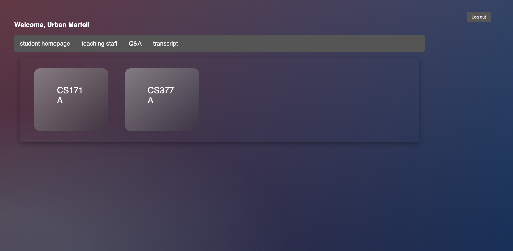
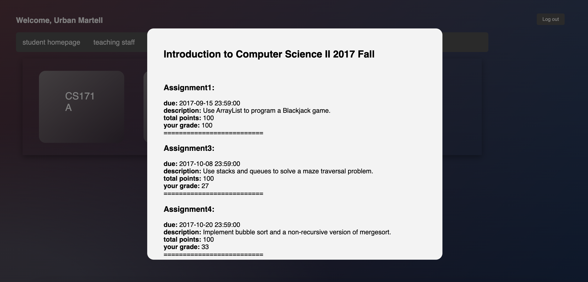
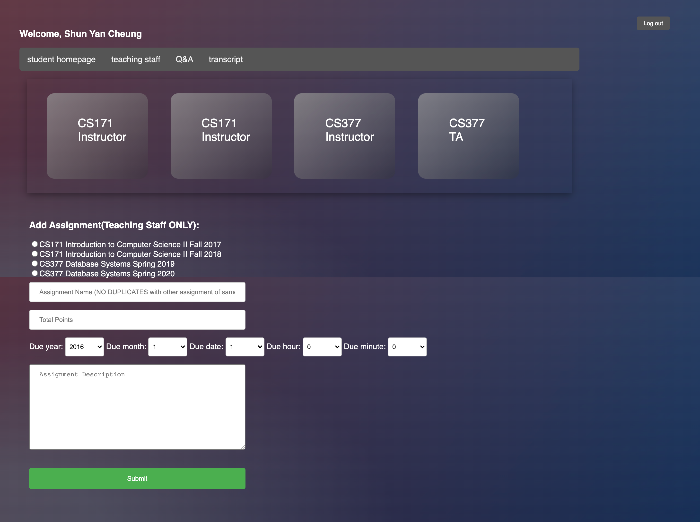
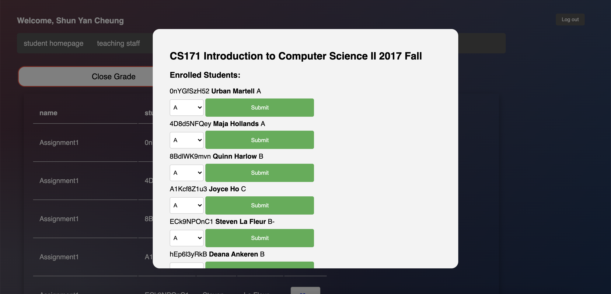
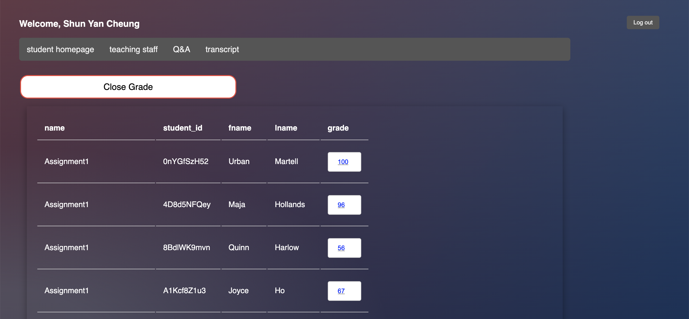
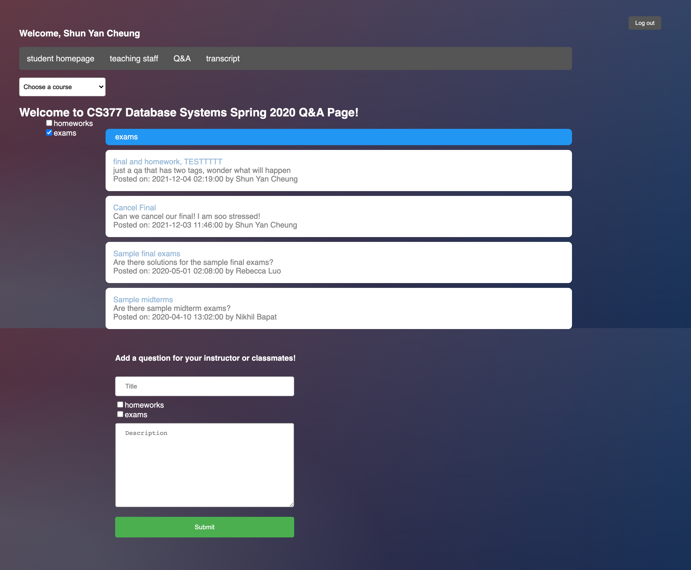
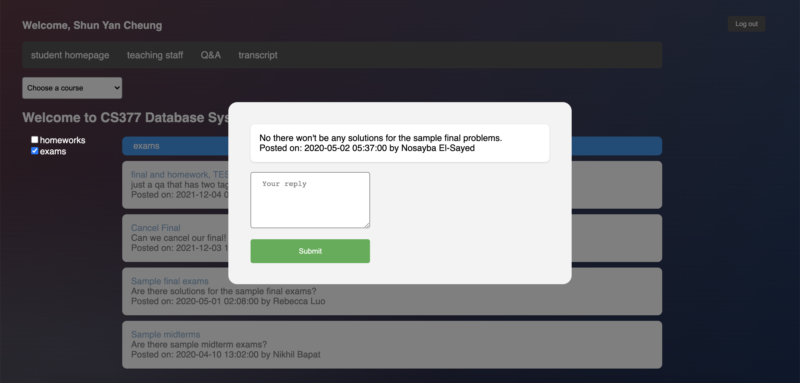
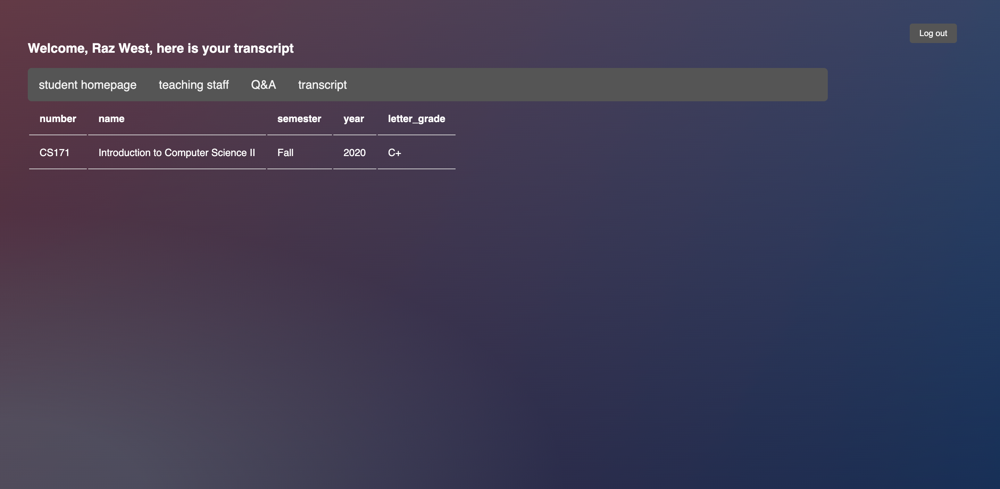

## Mystro: A Dynamic Website for Students and Faculties

http://34.73.80.85/login.php  

This project aims to utilize LAMP stack (Linux, Apache2, MySQL, PHP) along with HTML/CSS/Javascript to create an dynamic website.  

#### Login Page

#### Student Homepage

Clicking on any classes opens up a modal:

#### Teaching Staff Page

Add assignments by submitting the form:

Clicking on any classes opens up a modal where you can modify the assignments grade or course's letter grade for each student:

#### Q&A Page

Post a question by submitting the form:

Opens up a thread by clicking on the title of the question post:

#### Transcript Page

This page displays all the courses that the student have taken:

